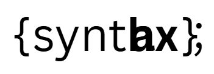

# Synthtax

**Code-first music mix engine** — write your mix in YAML, render with Python (`pydub`), prompt with AI.



## Quickstart

```bash
python -m venv .venv
.venv\Scripts\activate   # Windows
# source .venv/bin/activate  # macOS/Linux

pip install -r requirements.txt
python app.py
```

Open the local URL shown to use the UI. Drop some samples in `samples/` and start prompting.

## Supported Commands

Synthtax mixes are built from simple text commands:

- `load DRUM from "path.wav"` — load a sample
- `loop(track, bars=2)` — loop a track for a number of bars
- `gain(track, db)` — adjust volume in dB
- `fadeIn(track, seconds=2)` / `fadeOut(track, seconds=2)` — fade transitions
- `slice(track, start=0, duration=500)` — grab a mini-sample
- `reverse(track)` — reverse a track
- `reverb(track, amount=0.5)` — add simple reverb
- `export("mix.wav")` — write the final mix

## FFmpeg
Install FFmpeg and make sure it's on your PATH. Or set `FFMPEG_PATH` in `app.py`.

## Repo Layout
```
assets/     # logos etc.
context/    # product vision, prompts for Agent
samples/    # put your audio samples here (drums/textures/fx)
out/        # rendered audio (gitignored)
app.py      # Synthtax UI
recipe.yaml # example
```

## License
MIT © 2025 Adam Johnston
